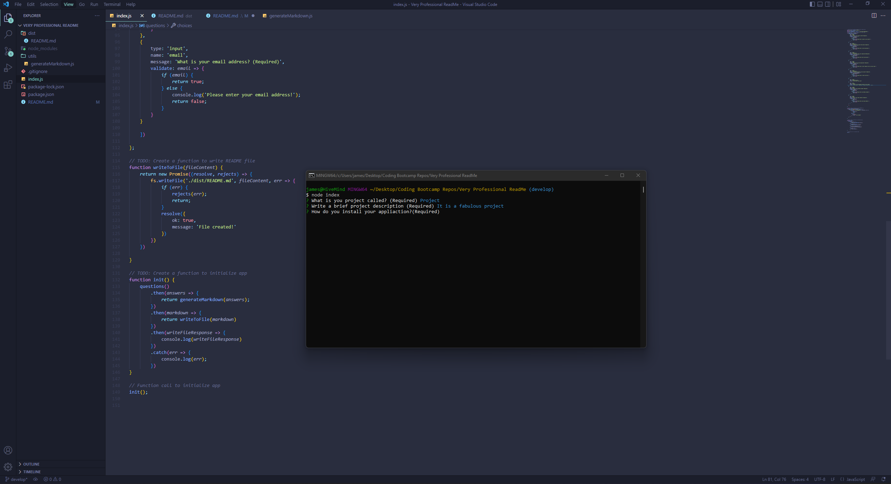

# Very Professional ReadMe

## Description
Very Professional ReadMe is a simple generator that will produce professional looking ReadMe files based on user input. We are using the inquirier package from node.js to retrieve that information and then generate the readme file all within Javascript. These ReadMe files will feature the appropriate html markdown used on GitHub so titles are displayed as the most predominant text followed by other sections of the ReadMe!

## Built with
* Javascript
* Node.js
* Inquirer 8.2.4

## Screeshot of Terminal while app in use

## Walkthrough Video
[Video Walkthrough]()

## Credits
* Created by MrPhuzzles ©️2022
* Starter code provided [here](https://github.com/coding-boot-camp/potential-enigma)
